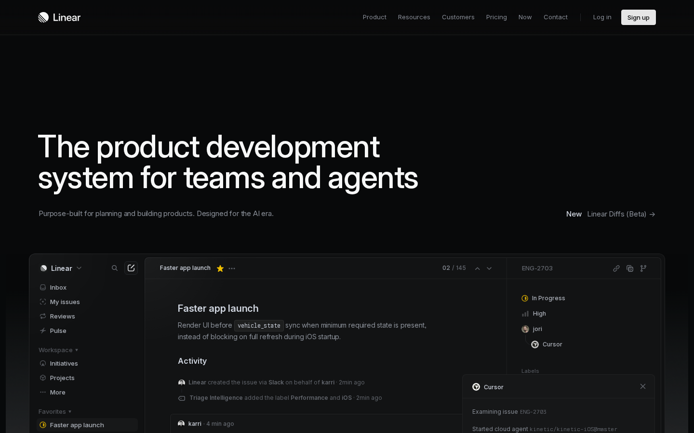
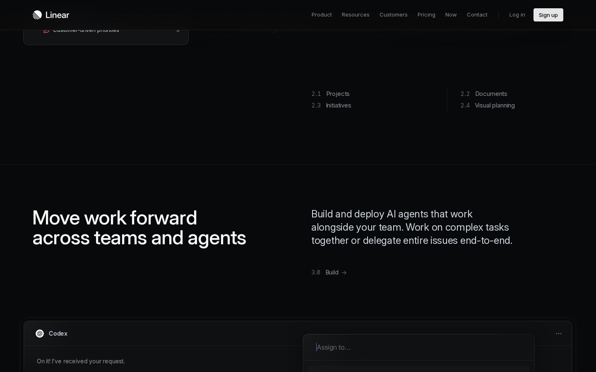
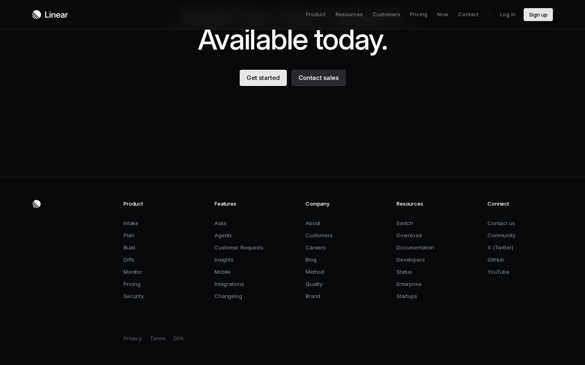

# LeafScan

**LeafScan** extracts the design DNA from any public webpage. Give it a URL, get back a structured design report covering typography, color system, animation, layout strategy, third-party dependencies, and a full **architecture reproduction blueprint**.

It uses a headless browser to render the page, scrolls through to trigger lazy-loaded content and animations, extracts CSS data from the live DOM, detects frontend frameworks and media elements, and sends both the structured data and viewport screenshots to an LLM for analysis. Reports are generated in both **Markdown** and **PDF** formats.

---

## Report showcase — linear.app

The following report was generated automatically by running `leafscan scan https://linear.app` with GPT-5.4 (vision mode, 12 scroll frames captured).

**Scroll-captured viewport samples:**

| Top of page | Mid-page | Bottom |
|:-----------:|:--------:|:------:|
|  |  |  |

<details>
<summary><b>Full generated report (click to expand)</b></summary>

### 1. Font System
- **Data shows:** The primary font is `"Inter Variable"` with fallbacks `"SF Pro Display", -apple-system, BlinkMacSystemFont, "Segoe UI", Roboto, ... sans-serif`.
- **Data shows:** `Inter Variable` is loaded with a weight range of `"100 900"`, indicating variable font usage.
- **Data shows:** `Berkeley Mono` is also loaded with weight range `"100 900"`. Screenshots suggest it is used selectively for code-like UI content.
- **Data shows:** Body text uses `fontSize: 16px`, `fontWeight: 400`, `lineHeight: 24px`.
- **Data shows:** Paragraphs use `fontSize: 15px`, `fontWeight: 400`, `lineHeight: 24px`, `letterSpacing: -0.165px`.
- **Data shows:** `h1` uses `fontSize: 64px`, `fontWeight: 510`, `lineHeight: 64px`, `letterSpacing: -1.408px`.
- **Data shows:** `[class*="heading"]` reaches `fontSize: 72px`, `fontWeight: 510`, `lineHeight: 72px`, `letterSpacing: -1.584px`.
- **Data shows:** `h2` uses `fontSize: 48px`, `fontWeight: 510`, `lineHeight: 48px`, `letterSpacing: -1.056px`.
- **Data shows:** `h3` uses `fontSize: 20px`, `fontWeight: 590`, `lineHeight: 26.6px`, `letterSpacing: -0.24px`.
- **Data shows:** Links use `fontSize: 14px`, `fontWeight: 510`, `lineHeight: 21px`.
- **Data shows:** No Google Fonts, Typekit, or external font service was detected.
- **Interpretation:** Fonts are likely self-hosted or served from the site's own asset pipeline rather than a third-party font CDN.
- **Interpretation:** The typography system is highly tuned around variable-weight midpoints like `510` and `590`, which gives headings a refined, slightly denser feel than standard 500/600 steps.
- **Interpretation:** Tight negative tracking on large headings reinforces a premium, modern SaaS aesthetic.
- **Interpretation:** The mono companion font supports product/demo surfaces and technical storytelling without changing the overall brand voice.

### 2. Color System
- **Data shows:** Body/background color is `rgb(8, 9, 10)` (`#08090A`).
- **Data shows:** Primary body text color is `rgb(247, 248, 248)` (`#F7F8F8`).
- **Data shows:** Secondary paragraph text color is `rgb(138, 143, 152)` (`#8A8F98`).
- **Data shows:** `h3` color is `rgb(208, 214, 224)` (`#D0D6E0`).
- **Data shows:** Links show `backgroundColor: rgb(94, 106, 210)` (`#5E6AD2`) with white text.
- **Data shows:** Screenshots show extensive use of very dark charcoal backgrounds, soft gray borders, muted labels, and occasional blue-violet accents.
- **Data shows:** No CSS custom properties were extracted: `css_vars: {}`.
- **Data shows:** No explicit `prefers-color-scheme` or dark-mode token set was provided.
- **Interpretation:** The likely primary brand/accent color is `#5E6AD2`, used for CTA/link emphasis and interactive highlights.
- **Interpretation:** The palette is a restrained dark theme with layered grays rather than pure black/white contrast.
- **Interpretation:** Dark mode is effectively the default visual mode. A separate light mode cannot be confirmed from the provided data.
- **Interpretation:** The absence of extracted color tokens suggests either runtime-generated styling, non-tokenized production CSS, or that token names were not exposed in the extraction layer.

### 3. Animation & Motion
- **Data shows:** No JS animation libraries were detected.
- **Data shows:** External scripts are bundled via Next.js/Webpack chunks, not CDN-loaded animation libraries.
- **Data shows:** A very large number of `@keyframes` rules exist for grid-dot animations:
  - `grid-dot-*-*-agent`
  - `grid-dot-*-*-upDown`
  - `grid-dot-*-*-pong`
- **Data shows:** These keyframes primarily animate `opacity` over sequenced percentage steps, suggesting patterned signal/activity animations.
- **Data shows:** Additional keyframes include:
  - `swipe-out-left` — translateX out + fade
  - `swipe-out-right` — translateX out + fade
  - `swipe-out-up` — translateY out + fade
  - `swipe-out-down` — translateY out + fade
  - `sonner-fade-in` — opacity + scale in
  - `sonner-fade-out` — opacity + scale out
  - `sonner-spin` — opacity pulsing/spinner effect
- **Data shows:** Transition declarations include:
  - `transform 0.4s`
  - `transform 0.4s, opacity 0.4s, height 0.4s, box-shadow 0.2s`
  - `opacity 0.4s, box-shadow 0.2s`
  - `opacity 0.1s, background 0.2s, border-color 0.2s`
  - `opacity 0.4s`
  - `transform 0.5s, opacity 0.2s`
  - `opacity 0.2s, transform 0.2s`
- **Data shows:** No ScrollTrigger, AOS, or explicit scroll animation library was detected.
- **Data shows:** No direct Intersection Observer signal was provided.
- **Interpretation:** Motion is implemented with native CSS animation/transitions plus app-bundled logic rather than relying on GSAP or similar libraries.
- **Interpretation:** The motion language is moderate: polished and frequent, but not heavy or cinematic.
- **Interpretation:** The repeated grid-dot keyframes indicate bespoke decorative/system-status animations tied to product storytelling visuals.
- **Interpretation:** Some transitions likely support hover states, reveal states, and layered UI card interactions seen in the screenshots.

### 4. Layout Strategy
- **Data shows:** `main` is `display: flex` with `flexDirection: column`.
- **Data shows:** `nav` is `display: flex` with `alignItems: center`.
- **Data shows:** `[class*="container"]` is generally `display: flex` with `flexDirection: column`.
- **Data shows:** No explicit grid configuration, max-width value, or gap token was extracted.
- **Data shows:** Screenshots show a strongly sectioned vertical page with repeated split layouts: large heading block on the left and explanatory copy or product visual on the right.
- **Data shows:** Screenshots show a top navigation bar spanning the width with a thin bottom border line.
- **Data shows:** Screenshots show content aligned inside a consistent centered page frame with generous horizontal margins.
- **Data shows:** Multiple sections appear full-bleed in background treatment while content stays internally constrained.
- **Interpretation:** The overall layout is mixed, but flexbox appears dominant at the top level, with likely nested grid/flex combinations inside content sections.
- **Interpretation:** The page likely uses a central max-width wrapper around ~1200–1280px, though this is not directly confirmed by extracted CSS.
- **Interpretation:** The design relies on large vertical spacing, wide gutters, and two-column editorial/product storytelling modules.
- **Interpretation:** Notable patterns include:
  - persistent header
  - full-bleed dark sections
  - split hero/content rows
  - product UI showcase cards
  - multi-column footer navigation

### 5. Third-Party Dependencies
- **Data shows:** No third-party font services were detected.
- **Data shows:** Fonts loaded:
  - `Inter Variable`
  - `Berkeley Mono`
- **Data shows:** External scripts are served from `https://static.linear.app/web/_next/static/...`.
- **Data shows:** Detected framework/build signals:
  - `Next.js`
  - `Webpack`
- **Data shows:** Notable external origins:
  - `api.linear.app`
  - `constellation.linear.app`
  - `e.linear.app`
  - `linear.app`
  - `static.linear.app`
  - `webassets.linear.app`
- **Data shows:** Sonner-related keyframes are present, suggesting the Sonner toast library or its styles may be included.
- **Interpretation:** The site appears to minimize third-party runtime dependencies on the marketing page and instead leans on its own asset/CDN ecosystem.
- **Interpretation:** `api.linear.app` and related subdomains indicate supporting application/backend services beyond the static marketing shell.

### 6. Design Style Summary
**Interpretation:** The site presents a premium, high-discipline enterprise SaaS aesthetic: dark, quiet, highly controlled, and product-first. The design language blends sharp typography, muted contrast, and polished in-product mockups to signal technical credibility and operational sophistication. It feels aimed at product, engineering, and AI-native teams who value calm interfaces over loud marketing. A distinctive decision is the way the brand turns real product UI into the visual system itself, instead of relying on generic illustration-heavy SaaS patterns.

### 7. Architecture & Reproduction Blueprint

#### 7.1 Detected Tech Stack
- **Data shows:** Frontend framework: not directly detected as React by the scanner, but `Next.js` is detected.
- **Data shows:** Meta-framework / SSR: `Next.js`
- **Data shows:** Build tool: `Webpack`
- **Data shows:** CSS approach: not explicitly detected.
- **Data shows:** Styling is not identifiable as Tailwind, CSS Modules, styled-components, or another system from the provided extraction alone.

#### 7.2 Recommended Reproduction Stack
- **Interpretation:** **Framework:** React is the best-fit reproduction choice because the detected site already runs on Next.js, which implies a React architecture. Matching the component model will make it easier to reproduce the complex marketing sections and reusable UI showcase patterns.
- **Interpretation:** **Meta-framework:** Next.js is the recommended choice for reproduction.
  - Strong fit for marketing sites with SEO requirements.
  - Supports hybrid static generation plus server rendering where needed.
  - Good for route-based content like product, pricing, changelog, and docs.
  - Aligns with the detected production stack.
- **Interpretation:** **Styling approach:** Use a tokenized CSS architecture with either:
  - CSS Modules + design tokens, or
  - Tailwind plus a disciplined theme layer.
- **Interpretation:** CSS Modules are the safer recommendation if the goal is pixel-faithful reproduction of nuanced spacing, borders, layered surfaces, and section-specific visual treatments.
- **Interpretation:** Tailwind could work, but the page's highly art-directed spacing and motion patterns may become harder to maintain cleanly unless paired with extracted component abstractions.
- **Interpretation:** **State management:** Minimal global state is likely needed for the marketing page itself.
  - Local component state for nav menus, hover states, tabs, carousels, and interactive demos.
  - Lightweight global state only if adding persistent UI states like announcement bars, theme preferences, or shared demo controls.
- **Interpretation:** A headless CMS is optional. If the changelog, navigation, footer links, and feature pages need editorial control, integrate one; otherwise static content files are enough.

#### 7.3 Component Breakdown
- **Interpretation:** A practical component tree would look like this:

- `<AppShell>`
  - Renders page chrome and global structure.
  - Props/data: navigation items, CTA labels/URLs, footer groups
  - Sub-components: `<Header>`, `<MainContent>`, `<Footer>`

- `<Header>`
  - Top navigation with logo, primary links, auth links, and signup CTA.
  - Sub-components: `<LogoMark>`, `<PrimaryNav>`, `<HeaderActions>`

- `<HeroSection>`
  - Large headline, supporting copy, announcement/new item link, and hero product mockup.
  - Sub-components: `<HeroCopy>`, `<AnnouncementLink>`, `<HeroProductFrame>`

- `<FeatureIntroRow>`
  - Three-column summary row with icon/illustration + title + body copy.
  - Sub-components: `<FeatureCard>`, `<LineIllustration>`

- `<StorySection>`
  - Repeating split section with left-aligned large title and right-aligned explanatory copy.
  - Sub-components: `<SectionEyebrow>`, `<SectionTitle>`, `<SectionBody>`, `<SectionCTA>`

- `<ProductShowcasePanel>`
  - Large framed UI demo area used repeatedly through the page.
  - Sub-components: `<MockWindow>`, `<MockSidebar>`, `<MockBoard>`, `<MockChatPanel>`, `<MockAnalyticsPanel>`

- `<FeatureIndex>`
  - Small numbered feature lists shown beside or below showcase modules.
  - Sub-components: `<FeatureIndexGroup>`, `<FeatureIndexItem>`

- `<AnalyticsShowcase>`
  - Chart-oriented product section with cards, bar charts, and scatterplot-like visual.
  - Sub-components: `<SummaryCard>`, `<BarChartMock>`, `<ScatterChartMock>`

- `<ChangelogSection>`
  - Horizontal release timeline/cards.
  - Sub-components: `<TimelineRail>`, `<ReleaseCard>`

- `<BottomCTASection>`
  - Large end-of-page call to action with button group.
  - Sub-components: `<CTAButtonGroup>`

- `<Footer>`
  - Multi-column footer link groups and legal links.
  - Sub-components: `<FooterColumn>`, `<FooterLegal>`

#### 7.4 Media & Rendering Requirements
- **Data shows:** No video elements detected.
- **Data shows:** No canvas elements detected.
- **Data shows:** `webgl: false`.
- **Data shows:** No iframe embeds detected.
- **Interpretation:** **Video:** None required for core reproduction based on provided data.
- **Interpretation:** **3D / WebGL:** No 3D engine is required. The decorative visuals in screenshots appear to be line-art illustrations or DOM/SVG-based compositions rather than real-time 3D.
- **Interpretation:** **Canvas:** Not necessary unless recreating charts with a charting library; even then SVG is likely sufficient.
- **Interpretation:** **Animations:** Prefer native CSS transitions and keyframes for opacity sequencing, hover motion, reveal states, and subtle panel transforms.
- **Interpretation:** Product mockups can be reproduced as static high-resolution images for speed, or structured DOM components for sharper responsiveness and hover-driven parallax/motion.

#### 7.5 External Services & APIs
- **Data shows:** CDN/API-related origins include: `api.linear.app`, `constellation.linear.app`, `e.linear.app`, `webassets.linear.app`
- **Interpretation:** Likely backend/service needs for reproduction:
  - CMS or structured content source for changelog, feature sections, footer/navigation, and announcements
  - analytics/event tracking for CTA clicks and page engagement
  - optional form backend for contact sales / signup intent capture

#### 7.6 Implementation Complexity Assessment
- **Interpretation:** **Overall complexity:** High
- **Interpretation:** **Estimated component count:** Approximately 25–40 unique components
- **Interpretation:** **Key technical challenges:**
  - Reproducing the polished dark-theme visual hierarchy without losing contrast discipline
  - Building responsive product showcase mockups that remain crisp and believable across breakpoints
  - Matching the subtle motion system, especially the sequenced dot/grid animations and layered panel transitions
- **Interpretation:** **Recommended build priority:**
  1. Global foundation: typography, colors, spacing scale, layout wrappers, buttons, nav, footer
  2. Hero and repeated split-story section pattern
  3. Reusable product showcase panel system
  4. Changelog/timeline and bottom CTA
  5. Motion polish and section-specific decorative animations

</details>

---

## Requirements

| Requirement | Notes |
|-------------|-------|
| Python 3.11+ | 3.12 recommended |
| **LeafHub** | API key management — install first (see below) |
| Internet connection | For page scraping and LLM API calls |

LeafScan uses **[LeafHub](https://github.com/Rebas9512/Leafhub)** for encrypted API key management. LeafHub must be installed and configured before you can run LeafScan. Head to the LeafHub repo to install it and add your provider credentials.

LeafScan supports three API backends:

| Backend | LeafHub `api_format` | Notes |
|---------|---------------------|-------|
| OpenAI Chat Completions | `openai-completions` | OpenAI, Groq, vLLM, any OpenAI-compatible endpoint |
| OpenAI Responses API | `openai-responses` | ChatGPT Codex endpoint — uses subscription quota, not API credits |
| Anthropic Messages | `anthropic-messages` | Anthropic, MiniMax (Anthropic-compatible) |

**Using your ChatGPT subscription** — run `leafhub provider login --name codex` to authenticate via OAuth. No API key needed; tokens auto-refresh on every request.

---

## Install

**macOS / Linux / WSL**

```bash
curl -fsSL https://raw.githubusercontent.com/Rebas9512/Leafscan/main/install.sh | bash
```

**Windows (PowerShell)**

```powershell
irm https://raw.githubusercontent.com/Rebas9512/Leafscan/main/install.ps1 | iex
```

**Windows (CMD)**

```cmd
curl -fsSL https://raw.githubusercontent.com/Rebas9512/Leafscan/main/install.cmd -o install.cmd && install.cmd && del install.cmd
```

The installer clones the repo, creates an isolated virtual environment, installs Playwright + Chromium, and registers the `leafscan` command on your PATH.


---

## Configure

LeafScan reads API credentials from LeafHub at startup. After installing LeafHub and adding a provider, link LeafScan to it:

```bash
leafhub register leafscan --path <leafscan-install-dir> --alias llm
```

Or let the setup script handle it automatically:

```bash
./setup.sh
```

`leafscan setup` can also be used at any time to verify or auto-repair the LeafHub binding.

To switch providers or add a second model, update them in LeafHub — no changes to LeafScan needed:

```bash
leafhub manage                                                # Web UI
leafhub project bind leafscan --alias minimax --provider "MiniMax"  # Add second model
```

---

## Run

```bash
# Scan a website
leafscan scan https://linear.app

# Use a specific model alias
leafscan scan https://linear.app --alias minimax

# Skip PDF generation (Markdown only)
leafscan scan https://linear.app --no-pdf
```

Output is saved to `outputs/{domain}_{timestamp}/`:

```
outputs/linear.app_20260323_214857/
├── frame_01.png ~ frame_12.png   # Scroll-captured viewport screenshots
├── css.json                       # Raw CSS extraction data
├── network.json                   # Network request log
├── assets.json                    # Aggregated libraries, fonts, CDN origins
├── report.md                      # LLM-generated design analysis report
└── report.pdf                     # PDF version of the report (optional)
```

---

## CLI reference

| Command | What it does |
|---------|-------------|
| `leafscan scan <url>` | Scan a URL and generate a design report (MD + PDF) |
| `leafscan scan <url> --alias <name>` | Scan using a specific LeafHub model alias |
| `leafscan scan <url> --no-pdf` | Scan without generating the PDF report |
| `leafscan setup` | Verify and repair LeafHub credential binding |
| `leafscan clean` | Remove all generated outputs |
| `leafscan clean -y` | Remove outputs without confirmation |

---

## How the pipeline works

```
URL
 │
 ▼
┌──────────────────────────────────────────────┐
│  Step 0: Model Resolution + Capability Probe │
│  Connect to LeafHub, send a test image to    │
│  determine if the model supports vision.     │
└──────────────────┬───────────────────────────┘
                   │
                   ▼
┌──────────────────────────────────────────────┐
│  Step 1+2: Scrape + Extract                  │
│  Playwright renders the page, auto-dismisses │
│  cookie banners, scrolls top-to-bottom       │
│  (DOM scroll or wheel events for WebGL),     │
│  captures viewport screenshots at each stop, │
│  then runs JS extraction on the fully        │
│  rendered DOM.                               │
└──────────────────┬───────────────────────────┘
                   │  produces
             ┌─────┴──────┐
             │ css.json   │  fonts, colors, keyframes, transitions, layout,
             │            │  detected frameworks, media elements
             │ assets.json│  detected libraries, font services, CDN origins,
             │            │  frameworks, build tools, media summary
             │ frame_*.png│  scroll-captured viewport screenshots
             └─────┬──────┘
                   │
                   ▼
┌──────────────────────────────────────────────┐
│  Step 3: Aggregate                           │
│  Merge network data + extractor output.      │
│  Identify libraries, frameworks, build tools │
│  from CDN URLs, global variables, and DOM.   │
└──────────────────┬───────────────────────────┘
                   │
                   ▼
┌──────────────────────────────────────────────┐
│  Step 4: LLM Report                          │
│  Sample ≤8 key frames from the scroll,       │
│  send structured CSS data + architecture     │
│  signals + screenshots to the LLM.           │
│  Receive Markdown design report with         │
│  architecture reproduction blueprint.        │
│                                              │
│  Adapts automatically:                       │
│    vision model → screenshots + data         │
│    text-only model → data only               │
└──────────────────┬───────────────────────────┘
                   │
                   ▼
┌──────────────────────────────────────────────┐
│  Step 5: PDF Export (optional)               │
│  Convert Markdown report to styled PDF.      │
│  Skip with --no-pdf or if deps not installed.│
└──────────────────────────────────────────────┘
```

### Scroll capture strategies

| Page type | Detection | Strategy |
|-----------|-----------|----------|
| Normal scrollable page | `scrollHeight > viewport + 100px` | DOM `scrollTo` in viewport steps, capture at each stop |
| WebGL / canvas site | `scrollHeight ≈ viewport` | Synthetic wheel events to drive Three.js / custom scroll handlers |

Cookie consent banners (OneTrust, TrustArc, CookieBot, etc.) are auto-dismissed before capture, including banners rendered inside iframes.

### Model capability probe

At pipeline start, a small test image is sent to the model. If accepted → vision mode (screenshots + data). If rejected → text-only mode (data only). This happens automatically — no configuration needed.

---

## Tested sites

| Site | Type | Frames | Key findings |
|------|------|--------|-------------|
| linear.app | SaaS landing page | 12 | Next.js + Webpack detected, Inter Variable, 607 keyframes, grid-dot animations |
| giellygreen.co.uk | Luxury beauty e-commerce | 12 | Vue + Nuxt detected, Prismic CMS + Shopify, Swiper, self-hosted fonts |
| nippori.lamm.tokyo | Editorial podcast site | 18 | WordPress + Remix detected, 7 self-hosted videos, Typekit + Google Fonts |
| ironhill.au | Premium brand microsite | 19 | Vue + Nuxt detected, WebGL2 canvas, 3 autoplay videos, self-hosted fonts |
| memorial.fcporto.pt | Video / narrative memorial | 30 | GSAP + ScrollTrigger + Lenis (bundled), Astro build |
| good-fella.com | Creative studio portfolio | 9 | Typekit fonts, 12-column grid, Next.js/Turbopack |
| d2c-lifescience.com | 3D life science | 30 | Custom 3D rendering, Prismic CMS, Astro build |
| cornrevolution.resn.global | WebGL experience | 9 | Three.js detected via global, wheel-event scroll capture |
| bruno-simon.com | Interactive 3D game | 9 | Rapier physics engine, Google Fonts, game-first layout |

---

## Project structure

```
Leafscan/
├── leafscan/
│   ├── __init__.py
│   ├── model.py          # LeafHub resolution + capability probe
│   ├── scraper.py        # Playwright: navigate, cookie dismiss, scroll, capture
│   ├── extractor.py      # Browser-side JS extraction + Python parser
│   ├── aggregator.py     # Library detection, font service matching, data merge
│   ├── reporter.py       # LLM call with api_format adapters
│   ├── pdf.py            # Markdown → PDF conversion (optional deps)
│   ├── pipeline.py       # Orchestration: probe → scrape → aggregate → report → PDF
│   └── cli.py            # CLI entry point
│
├── prompts/
│   └── design_report.txt # LLM system prompt
│
├── tests/
│   ├── smoke_e2e.py      # End-to-end smoke test
│   ├── test_model.py     # Capability probe tests
│   ├── test_reporter.py  # Payload builder + API adapter tests
│   ├── test_aggregator.py# Library / font / framework detection tests
│   ├── test_extractor.py # CSS data parser tests
│   └── test_pdf.py       # PDF converter tests
│
├── outputs/              # Generated reports (git-ignored)
├── leafhub_dist/         # LeafHub integration module (auto-generated)
├── pyproject.toml
├── setup.sh
└── install.sh / install.ps1 / install.cmd
```

## Acknowledgements

- [**LeafHub**](https://github.com/Rebas9512/Leafhub) — local encrypted API key vault, required for credential management
- [**Playwright**](https://playwright.dev/) — headless browser automation
